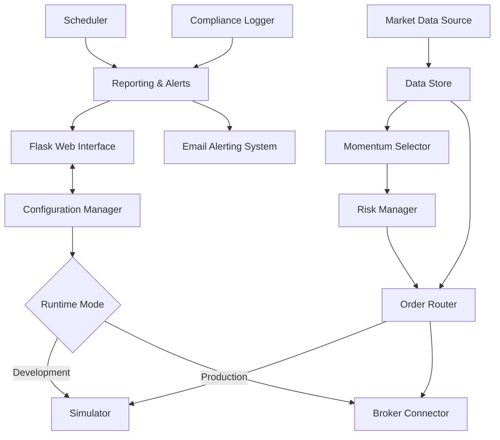

# Automated Trading System Design Document

## 1. Overview

### 1.1 Purpose
This document outlines the design of a Python-based automated trading system that selects momentum stocks and places, modifies, and exits trades on Indian exchanges through the Zerodha Kite Connect API. The system will operate in two modes: development (paper-trading simulation) and production (live trading).

### 1.2 Goals
- Build a robust automated trading system for Indian markets using Zerodha Kite Connect API
- Implement momentum-based stock selection strategies with configurable parameters
- Support both paper-trading (simulation) and live trading modes
- Ensure compliance with SEBI's retail algo trading regulations
- Provide comprehensive risk management and audit logging capabilities

### 1.3 Key Features
- Integration with Zerodha Kite Connect for market data and order execution
- Pluggable momentum stock selection engine with multiple strategies
- Comprehensive risk management with position sizing and exposure controls
- Dual-mode operation (development/simulation and production)
- Compliance with SEBI retail algo trading framework
- Real-time monitoring, alerting, and reporting capabilities
- Web-based user interface with real-time dashboard (Flask)
- Detailed performance reporting (daily, weekly, and cumulative P&L)
- Order execution tracking and status monitoring
- Stock selection visualization and strategy insights
- Email alerting for critical events and system notifications
- Manual override capabilities through web interface
- Configuration management via web UI

## 2. Architecture

### 2.1 System Components



### 2.2 Core Modules

1. **BrokerConnector**: Interface with Zerodha Kite Connect API for market data and order execution
2. **DataStore**: Persistent storage for market data, trades, configurations, and logs
3. **SelectorEngine**: Momentum stock selection with pluggable strategies
4. **RiskManager**: Position sizing, exposure controls, and risk limits enforcement
5. **OrderRouter**: Order placement, modification, and state management
6. **Simulator**: Paper-trading engine for development mode
7. **Scheduler**: Market-aware job scheduling with holiday awareness
8. **Reporting & Alerts**: Dashboard metrics, reports, and alerting system
9. **ComplianceLogger**: Immutable audit trail for regulatory compliance
10. **WebInterface**: Flask-based web application for UI and API endpoints
11. **EmailAlerting**: Email notification system for critical events and reports

### 2.3 Runtime Environments

- **Development Mode**: Local execution with simulated order fills and P&L
- **Production Mode**: Live trading with real order execution and full risk controls

## 3. API Endpoints Reference

### 3.1 Authentication & Session Management
- OAuth flow for initial authentication
- Automatic token refresh mechanism
- Session validation and reconnection handling

### 3.2 Order Management APIs
- Place orders (MARKET, LIMIT, SL-M, SL-LIMIT)
- Modify existing orders
- Cancel orders
- Query order book, positions, and trade history
- Margin and funds availability checks

### 3.3 Market Data APIs
- LTP (Last Traded Price) retrieval
- Quote data retrieval
- WebSocket streaming for real-time ticks
- Instrument master data synchronization

### 3.4 Authentication Requirements
- API key and secret required for all requests
- Access token with automatic refresh
- Rate limiting compliance

## 4. Data Models & ORM Mapping

### 4.1 Core Data Entities

| Entity | Description | Storage |
|--------|-------------|---------|
| Instrument | Tradable securities with metadata | TimescaleDB |
| MarketData | Price, volume, and quote data | TimescaleDB |
| Order | Order details and state tracking | TimescaleDB |
| Trade | Executed trades with fill details | TimescaleDB |
| Position | Current portfolio positions | TimescaleDB |
| Strategy | Momentum selection parameters | TimescaleDB |
| Configuration | System settings and thresholds | TimescaleDB |
| Log | Audit trail and system events | Object Store |

### 4.2 Database Schema

``mermaid
erDiagram
    INSTRUMENT ||--o{ MARKETDATA : "has"
    INSTRUMENT ||--o{ ORDER : "traded"
    ORDER ||--o{ TRADE : "executes"
    INSTRUMENT ||--o{ POSITION : "holds"
    STRATEGY ||--o{ ORDER : "generates"
    CONFIGURATION ||--o{ ORDER : "governs"
```

## 5. Business Logic Layer

### 5.1 Momentum Stock Selection

#### 5.1.1 Strategy Components
- Price momentum factors (ROC, breakout, ADX)
- Liquidity screens (turnover, volume)
- Volatility filters (ATR normalization)
- Risk checks (ASM/GSM exclusion)
- News sentiment (optional secondary filter)

#### 5.1.2 Universe Definitions
- NIFTY 100/200 indices
- Custom watchlists
- Configurable rebalance cadence

### 5.2 Signal Generation & Risk Management

#### 5.2.1 Signal Lifecycle
1. Signal generation with timestamp, symbol, side, size
2. Risk manager approval based on:
   - Max % capital per trade
   - Max concurrent trades
   - Daily max loss limits
   - Per-symbol exposure caps
3. Order routing with support for:
   - Market/Limit/SL-M/SL-Limit orders
   - MIS/NRML/CNC product types
   - Bracket-like behavior simulation

#### 5.2.2 Order State Machine

``mermaid
stateDiagram-v2
    [*] --> NEW
    NEW --> PLACED
    PLACED --> PARTIAL
    PLACED --> FILLED
    PARTIAL --> FILLED
    FILLED --> EXIT_PENDING
    EXIT_PENDING --> CLOSED
    NEW --> ERROR
    PLACED --> ERROR
    PARTIAL --> ERROR
    ERROR --> REJECTED
```

### 5.3 Risk Management Rules

#### 5.3.1 Position Sizing
- ATR-based position sizing for volatility normalization
- Max risk per trade (e.g., ≤1% of equity)

#### 5.3.2 Portfolio Limits
- Maximum concurrent symbols
- Sector exposure caps
- Single-name exposure limits

#### 5.3.3 Daily Controls
- Daily loss stop mechanism
- Kill switch for immediate order cessation
- Order hygiene checks (price bands, freeze quantities)

## 6. Middleware & Interceptors

### 6.1 Rate Limiting
- API throttling compliance for Kite Connect
- Request queuing and backoff mechanisms
- Connection pooling for efficiency

### 6.2 Error Handling
- Retry policies with exponential backoff
- Idempotency keys for duplicate prevention
- Graceful degradation during connectivity issues

### 6.3 Security
- Secure storage of API credentials (OS keyring/KMS)
- TLS encryption for all communications
- Segregation of production and development credentials
- Web application security (CSRF, authentication, authorization)
- Input validation and sanitization for web endpoints

## 7. Testing

### 7.1 Unit Tests
- Selector engine algorithms
- Risk management calculations
- Order state machine transitions
- Configuration validation

### 7.2 Integration Tests
- Mock-based testing for Kite Connect APIs
- Order lifecycle simulation
- Risk control validation

### 7.3 Replay Testing
- Historical data replay for P&L validation
- Benchmark comparison testing

### 7.4 Staging Environment
- Dry-run testing during live market hours
- Latency and log validation
- Alerting system testing

## 8. Compliance & Auditability

### 8.1 SEBI Compliance
- Algorithm registration and labeling per SEBI framework
- Immutable audit logs for all trading activities
- Unique algo/order identifiers for traceability
- Strategy versioning with approval tracking

### 8.2 Data Retention
- 7-year retention for audit logs
- Configurable retention policies for other data

## 9. Trading Session Management

### 9.1 Market Timings
- Pre-open session (09:00-09:15 IST)
- Regular trading session (09:15-15:30 IST)
- Holiday calendar integration

### 9.2 Scheduler
- Intraday scanning at configurable intervals
- Pre-open list preparation
- Market-aware job execution prevention

## 10. Reporting & Monitoring

### 10.1 Dashboards
- Today's signals, positions, P&L
- Real-time order execution tracking
- Momentum stock selection insights
- Risk usage metrics
- Error rates and system health
- Performance analytics (daily, weekly, cumulative)

### 10.2 Daily EOD Pack
- Trades ledger with complete execution details
- P&L analysis and attribution
- Slippage reports
- Performance summaries (daily, weekly, cumulative)
- Momentum strategy effectiveness reports
- Compliance logs

### 10.3 Alerting System
- Email notifications for critical events
- Telegram/Slack integration for real-time alerts
- Alert types:
  - Order rejects and errors
  - Connectivity issues
  - Risk limit breaches
  - Kill-switch events
- Configurable alert thresholds and recipients
- Alert deduplication and escalation policies

## 14. Web Interface (Flask-based)

### 14.1 Flask Web Application
- Single Flask application serving both web interface and API endpoints
- Real-time dashboard for monitoring trading activities
- Configuration management UI
- Manual override capabilities for risk controls

### 14.2 UI Components
- Dashboard with real-time P&L, positions, and risk metrics
- Order execution tracking and status monitoring
- Stock selection criteria visualization and strategy insights
- Comprehensive performance reporting (see section 14.5)
- Order management interface
- Configuration editor for strategy parameters
- Alert history and notification center
- Trading logs and audit trail viewer

### 14.3 Web Server Architecture
- Flask backend with RESTful API endpoints
- WebSocket support for real-time updates
- Jinja2 templates for server-side rendering
- Static asset delivery (CSS, JavaScript)

### 14.4 Security Considerations
- Authentication and authorization for UI access
- CSRF protection for form submissions
- Secure session management
- Role-based access control (Trader, Compliance, Admin)

### 14.5 Performance Reporting

#### 14.5.1 Real-time Performance Tracking
- Live P&L monitoring with visual charts and graphs
- Intraday performance metrics and equity curve visualization
- Real-time risk exposure and position tracking
- Order fill rates and execution quality metrics

#### 14.5.2 Periodic Performance Reports
- Daily performance summaries with detailed P&L breakdown
- Weekly performance analysis with comparative benchmarks
- Monthly and quarterly performance reports
- Year-to-date cumulative performance tracking

#### 14.5.3 Strategy Performance Analytics
- Momentum strategy effectiveness tracking
- Stock selection success rates and performance attribution
- Risk-adjusted return metrics (Sharpe, Sortino ratios)
- Drawdown analysis and recovery metrics

#### 14.5.4 Order Execution Reports
- Detailed order execution history with timestamps
- Fill quality analysis and slippage tracking
- Order rejection and error analysis
- Execution timing and market impact assessment

## 11. Configuration & Secrets Management

### 11.1 Configuration Structure
- YAML-based configuration files
- Environment-specific settings
- Strategy parameters and thresholds

### 11.2 Secrets Management
- OS keyring or KMS for API credentials
- Separation of production and development secrets
- Credential rotation policies

## 12. Deployment Architecture

### 12.1 Production Environment
- Secured VM/container with restricted access
- Continuous monitoring and alerting
- Backup and disaster recovery procedures

### 12.2 Development Environment
- Local machine or sandbox VM
- No real order execution
- Full simulation capabilities

## 13. Operational Procedures

### 13.1 Recovery Procedures
- WebSocket disconnection handling and reconnection
- Order reconciliation processes
- Data consistency checks

### 13.2 Daily Operations
- Market open procedures
- Intraday monitoring
- Market close and EOD processes

### 13.3 Emergency Procedures
- Kill switch activation
- System shutdown protocols
- Incident response procedures

## 12. Email Alerting System

### 12.1 Email Configuration
- SMTP server settings for email delivery
- Template-based email formatting
- Support for HTML and plain text emails
- Configurable sender and recipient addresses

### 12.2 Alert Types and Templates
- Order execution alerts (fills, rejections)
- Risk limit breach notifications
- System health alerts (connectivity, errors)
- Daily summary reports
- Emergency notifications (kill switch, system halt)

### 12.3 Email Delivery Management
- Retry mechanisms for failed deliveries
- Rate limiting to prevent spam filtering
- Alert deduplication to avoid notification floods
- Priority levels for different alert types

### 12.4 Integration with Web Interface
- Email template editor in the web UI
- Alert history and delivery status tracking
- User preferences for email notifications
- Test email functionality for configuration validation
